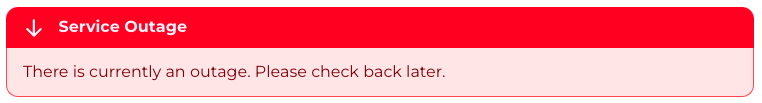

Announcements can be created to communicate important information to your staff and customers such as maintenance
windows or new features.

## Creating an Announcement

To create an announcement, navigate to the `Announcements` section of the `Settings` dashboard and
click `New announcement`.

### Scheduling an Announcement

You can schedule an announcement to be displayed at a future date by setting the `Start Date` and `End Date` fields.
