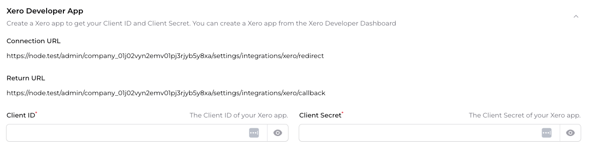
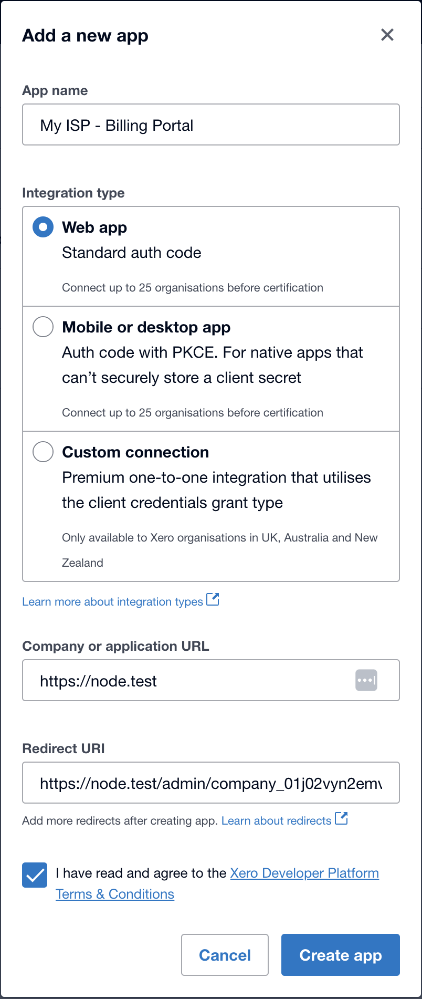
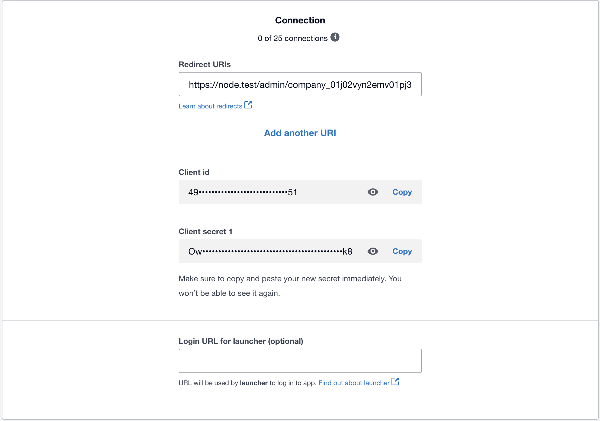
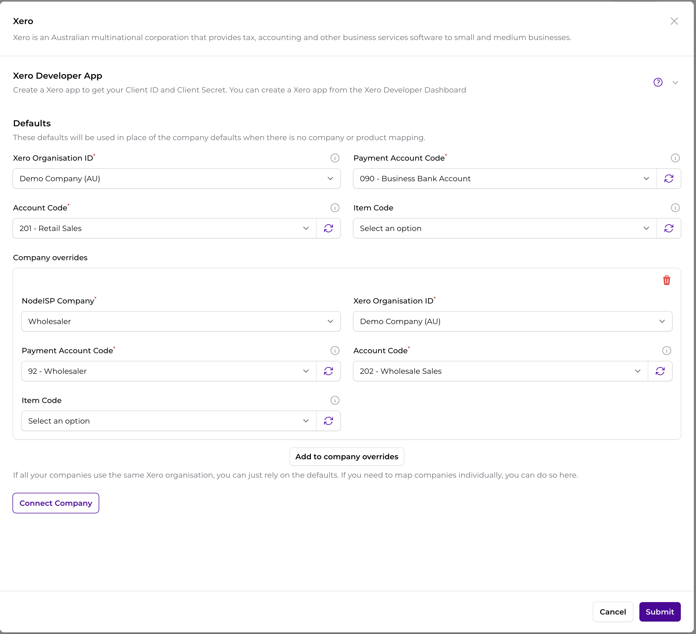
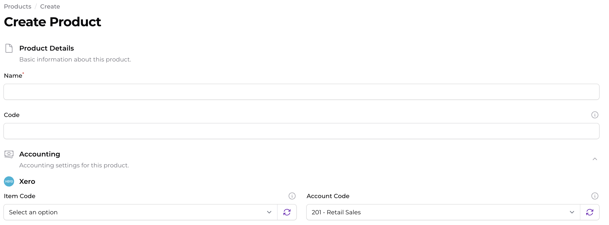

import {Aside} from '@astrojs/starlight/components';

NodeISP integrates with Xero to provide seamless synchronisation of your financial data. This integration allows you to:

- Automatically synchronise customers from NodeISP to Xero
- Automatically synchronise invoices and payments from NodeISP to Xero
- Automatically synchronise payments from NodeISP to Xero

## Self-Hosted

If you are self-hosting NodeISP, you will need to apply for a Xero Developer account and create an Application. You can
do this by following the instructions on the <a href="https://developer.xero.com/" target="_blank">Xero
Developer Portal</a>

You can find your Redirect URI in the `Settings` -> `Integrations` page of the NodeISP dashboard, by clicking on the
`Connect` or `Edit` button next to the Xero integration.

Once you have created an Application key, you will need to enter the following details into the Xero integration
settings
within the NodeISP dashboard:

- Client ID
- Client Secret

### Locating your Redirect URI

You can find your Redirect URI in the `Settings` -> `Integrations` page of the NodeISP dashboard, by clicking on the
`Connect` or `Edit` button next to the Xero integration.

### Creating a Xero Application

Go to the <a href="https://developer.xero.com/app/manage/" target="_blank">My Apps</a> page in
the https://developer.xero.com/app/manage/ and create a new application with the following details:

- App Name: My ISP - Billing Portal
- Integration type: Web app
- Company or application URL: https://myisp.com.au
- Redirect URI: The Redirect URI from the NodeISP dashboard

### Obtaining your Client ID and Client Secret

Once you have created the application, you will be redirected to the application details page. Navigate to the
`Configuration` tab and `Generate a secret` for your application.

<Aside type="danger">
    Make sure to copy the Client Secret immediately as it will not be displayed again.
</Aside>

### Entering your Client ID and Client Secret

Once you have created the application, you will need to enter the Client ID and Client Secret into the Xero integration
settings within the NodeISP dashboard. This can be found in the `Settings` -> `Integrations` page of the NodeISP
dashboard, where you obtained the Redirect URI.

Save the settings, and you will be able to move on to the next step of connecting your Xero account to NodeISP.

## Cloud-Hosted

If you are using the cloud-hosted version of NodeISP, you can skip the above steps, and simply skip to the next section
on connecting your Xero account.

## Connecting your Xero Accounts

To connect your Xero account to NodeISP, you will need to click on the `Connect Company` button in the Xero integration
settings page of the NodeISP dashboard.

This will redirect you to the Xero login page, where you will need to enter your Xero credentials and authorise the
NodeISP application to access your Xero account.

Once you have authorised the application, you will be redirected back to the NodeISP dashboard, where you will see a
success message indicating that your Xero account has been successfully connected.

1. Navigate to the `Settings` -> `Integrations` page of the NodeISP dashboard
2. Click on the `Connect` or `Edit` button next to the Xero integration
3. Click on the `Connect Company` button at the bottom of the form, and follow the prompts to authorise the NodeISP application to access your
Xero account

## Configuring your Xero Integration

Once you have connected your Xero account to NodeISP, you will need to configure the integration settings to specify how
you want your financial data to be synchronised between NodeISP and Xero.

Xero allows you to select multiple Organisations as part of connecting, and you can map a Xero Organisation to a NodeISP Company.

### Setting Defaults

The defaults are used when there is no override for a specific item. For example, if you have a default account code for payments set,
this will be used for all payments unless you specify a different account code for a specific payment.

### Mapping Companies

You can map a Xero Organisation to a NodeISP Company. This allows you to synchronise data between the two systems. If you have multiple
Xero Organisations, you can map each one to a different NodeISP Company. This allows you to split for example Retail and Wholesale customers
into different Xero Organisations.

### Mapping Products

You can map `Products` in NodeISP to `Items` in Xero. This allows you to synchronise invoices and payments with the correct product codes, to improve reporting in Xero.

Once you have connected Xero, you will be presented with options on the product create and edit forms. If these are not set, the default product code will be used.

