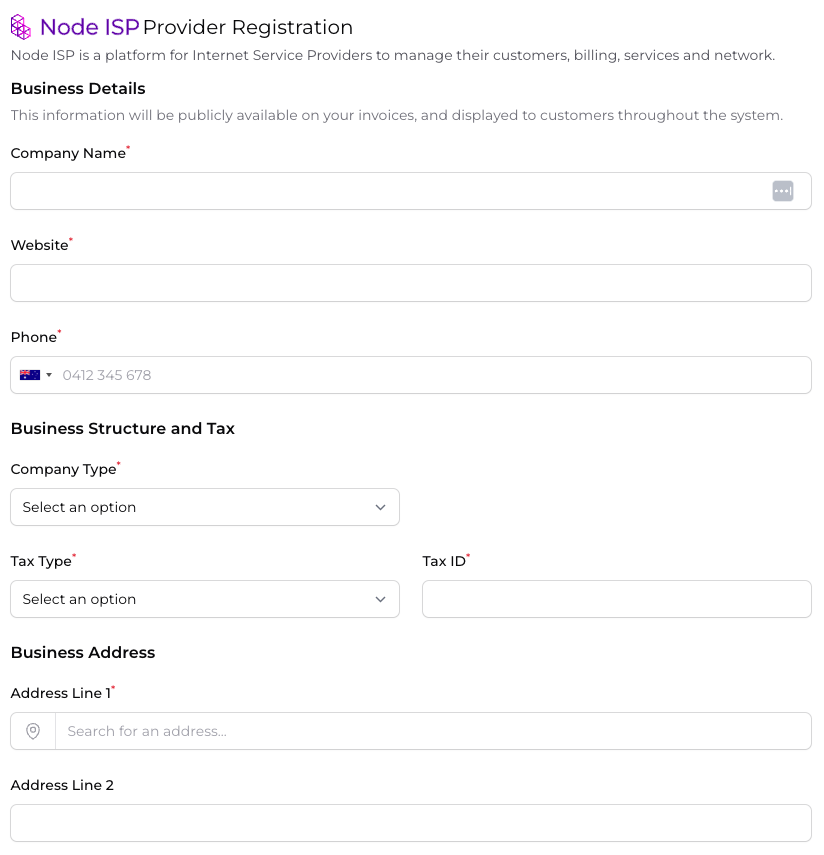

## Create a Company and Super-User

When you first load the NodeISP dashboard, you will be prompted to create a new company. This company will be the root
entity for all other entities in the system.

Multiple companies are supported, and can be used to separate different business units or departments within your
organisation, for example a retail ISP and a wholesale ISP.

Fill out your business details, tax information and super-user details, and click `Register Company` to continue.

You will be redirected to the dashboard, where you can begin configuring your instance.

## Configure NodeISP

NodeISP exposes a number of configuration options to allow you to customise your instance to your needs. These options
can be found in the `Settings` section of the dashboard, but let's start with the basics.

Follow through the Configuration sections of this guide to continue.
